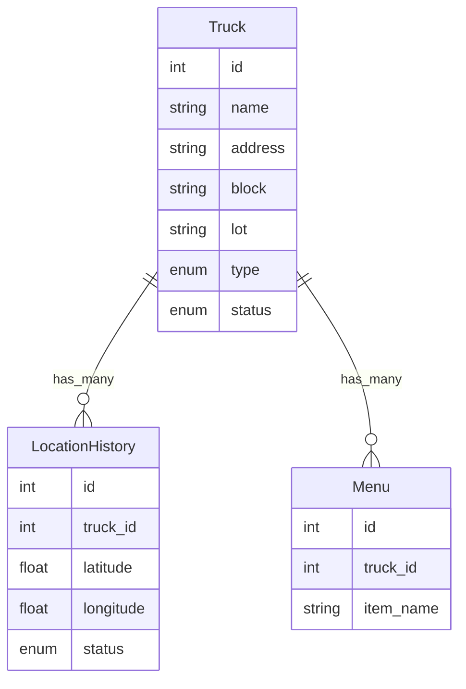
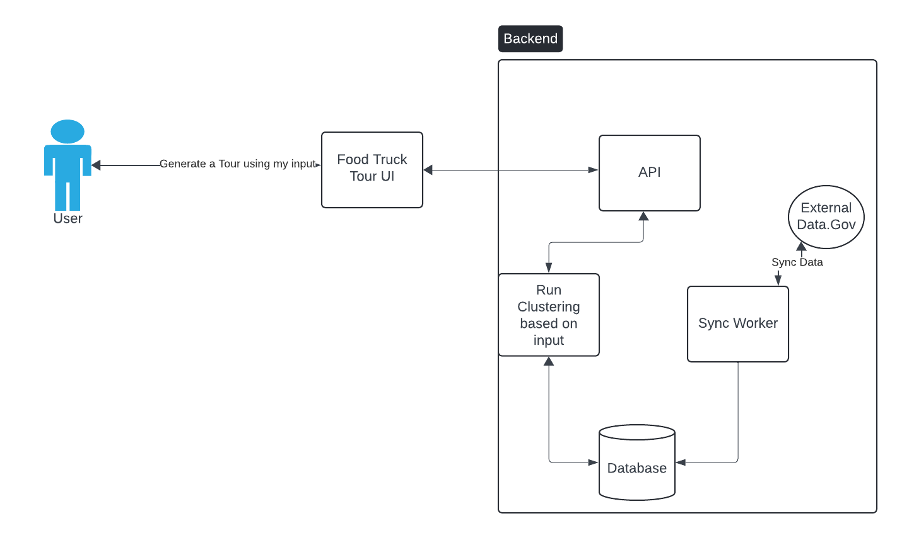

# FoodTruckApi

## Overview

- The goal of this project is to create a food truck API that will allow users to generate custom fodd truck tours based on their location and preferences.

- The API will also allow users to track their truck's location over time as they tend to move around.

## ERD

- We will use a separate table to track the location history of the trucks.This will help us to track the truck's location over time as they tend to move around.
- We will use a separate table to track the menu items of the trucks. We can hopefully use this to do some categorization or filtering.
- The truck type can be use to generation differnt icons for the trucks.
- The status fields helps us filter out the trucks that are not suitable for the user.

## Design

Inline-style:

## Future Work

- [ ] Add better parsing logic for menu items
- [ ] Add data model to support truck work hours/schedules
- [ ] Use liveview instead of separate react frontend
- [ ] Track a truck's changing menu over time
- [ ] I need to make sure locations and menu items access are scoped to the truck they belong to
- [ ] It is a good idea to add pagionation to the index endpoints
- [ ] Create a clustering algoirthm to dynamically generate the tour routes based on the user's preference and truck current location

## Tech Stack

- Elixir
- Phoenix
- Ecto
- PostgreSQL
- LiveView
- Tailwind CSS
- Next Js

## Running the App

### You will need

- To have access to a postgres database

### Running the Backend

- cd into the `food_truck_api` directory
- run `mix deps.get` to install dependencies
- Update the `config/dev.exs` file with your postgres database credentials
- run `mix ecto.create` to create the database
- run `mix ecto.migrate` to migrate the database
- run `iex -S mix phx.server` to start the server

**NOTE:** Incase the data is not seeded, run `mix run priv/repo/seeds.exs` to seed the database

#### Testing the backend

- Run `mix test` to run the tests

### Running the Frontend

- cd into the `food_tour_ui` directory
- run `npm install` to install dependencies
- run `npm run dev` to start the server
